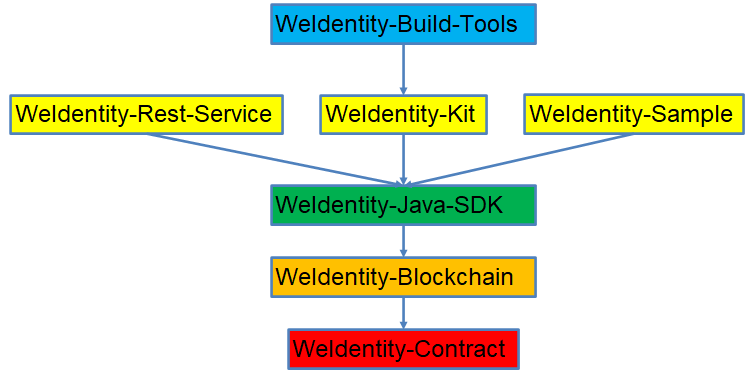

# WeIdentity 各组件版本和关系说明

标签：``WeId版本说明`` ``兼容性`` ``Release Note`` ``组件关系``

当前WeIdentity `v1.8.5`及以上版本已支持 FISCO BCOS 2.x 和 FISCO BCOS 3.x
- FISCO-BCOS 2.0与3.0对比、JDK版本、WeIdentity、WeBASE及其他子系统的[兼容版本说明](https://fisco-bcos-documentation.readthedocs.io/zh_CN/latest/docs/compatibility.html)请查看!

## 组件说明

WeIdentity的最新代码位于develop分支，具体某个版本的代码可切换到对应的`release`分支，如，查看WeIdentity v3.1.0-rc.1的代码，则切换到`release/3.1.0`分支。

| 项目   |  功能简介      | 最新版本          |   文档    | github  | gitee | 备注 |
| :----    | :----          | :----           | :----    |  :----    |  :---- |:---- |
| **WeIdentity** (weid-java-sdk) |  分布式身份解决方案 |     v3.1.1-rc.2    | [文档](https://weidentity.readthedocs.io/zh_CN/latest/)、[接口文档](https://weidentity.readthedocs.io/projects/javasdk/zh_CN/latest/docs/weidentity-java-sdk-doc.html)、 [设计规范](https://weidentity.readthedocs.io/zh_CN/latest/docs/weidentity-spec.html)  | [github](https://github.com/WeBankBlockchain/WeIdentity)  | [gitee](https://gitee.com/WeBank/WeIdentity)  | 符合W3C DID最新规范  |
| **WeIdentity-Build-Tools** |  WeIdentity部署工具 |     v3.1.1-rc.2    | [文档](https://weidentity.readthedocs.io/zh_CN/latest/docs/weidentity-installation-by-web.html)  | [github](https://github.com/WeBankBlockchain/WeIdentity-Build-Tools)  | [gitee](https://gitee.com/WeBank/WeIdentity-Build-Tools)  | 通过安装部署工具可以快速的在您的应用项目中集成weid-java-sdk  |
| **WeIdentity-Blockchain** |  WeIdentity 区块链接入服务 |     v3.1.1-rc.2    | [文档](https://weidentity.readthedocs.io/zh_CN/latest/docs/weidentity-bloackchain.html)  | [github](https://github.com/WeBankBlockchain/WeIdentity-Blockchain)  | [gitee](https://gitee.com/WeBank/WeIdentity-Blockchain)  |  为WeIdentity提供区块链相关功能，包括调用WeIdentity的智能合约和使用区块链的基础通信等功能，而且可以适配多种不同区块链，使得WeIdentity更加通用 |
| **WeIdentity-Kit** |  WeIdentity 拓展工具箱 |     v3.1.1-rc.2    | [文档](https://weidentity.readthedocs.io/zh_CN/latest/docs/weidentity-kit.html)  | [github](https://github.com/WeBankBlockchain/WeIdentity-Kit)  | [gitee](https://gitee.com/WeBank/WeIdentity-Kit)  |  为WeIdentity提供了多种实用工具，包括不同传输协议、鉴权流程和对可验证凭证（VC）的多种格式转化。 |
| **WeIdentity-Contract** (weid-contract-java) |  WeIdentity 合约代码 |     v1.3.2    | [文档](https://weidentity.readthedocs.io/zh_CN/latest/docs/weidentity-contract-design.html)  | [github](https://github.com/WeBankBlockchain/WeIdentity-Contract)  | [gitee](https://gitee.com/WeBank/WeIdentity-Contract)  | 符合W3C DID最新规范，使用新的合约存储。旧版本参考v1.2.30  |
| **WeIdentity-Sample** |  WeIdentity sample代码 |     v3.1.1    | [文档](https://weidentity.readthedocs.io/zh_CN/latest/docs/weidentity-sample-tryit.html)  | [github](https://github.com/WeBankBlockchain/WeIdentity-Sample)  | [gitee](https://gitee.com/WeBank/WeIdentity-Sample)  | WeIdentity-Java-SDK各个接口的直接调用示例  |
| **WeIdentity-Rest-Service** |  WeIdentity restful服务 |     v3.1.0    | [文档](https://weidentity.readthedocs.io/zh_CN/latest/docs/weidentity-rest-design.html)  | [github](https://github.com/WeBankBlockchain/WeIdentity-Rest-Service)  | [gitee](https://gitee.com/WeBank/WeIdentity-Rest-Service)  |  提供以RestFul方式调用WeIdentity-Java-SDK各个接口 |

如果使用WeIdentity，可根据在下文的**版本说明表格**中找到**对应的组件版本**后进行部署使用。如，WeIdentity v1.8.4版本，对应WeIdentity-Build-Tools的版本为v1.0.28。

## 组件关系

各组件的依赖关系如下图，可以看出WeIdentity-Java-SDK是整个WeIdentity的核心，提供W3C DID和VC规范的完整实现，WeIdentity-Java-SDK通过WeIdentity-Blockchain组件与区块链交互，具体而言是与部署在区块链上的智能合约即WeIdentity-Contract交互（存储数据和权限控制等）。在WeIdentity-Java-SDK上面是对其接口的不同调用方式（WeIdentity-Sample和WeIdentity-Rest-Service）和功能扩展（WeIdentity-Kit）。最上层是WeIdentity的部署工具WeIdentity-Build-Tools，同时也提供了对WeIdentity-Java-SDK部分接口的可视化的调用、数据展示和状态管理等功能。

## 版本说明
--------

| WeIdentity |  Build-Tools  | Blockchain  | Kit  |Sample  | Rest-Service | WeId-Contract | 备注 |
| :----    | :----     | :---- | :----| :----| :----|  :----|  :----|
|  v3.1.1-rc.2 |  v3.1.1-rc.2 | v3.1.1-rc.2 | v3.1.1-rc.2 |   v3.1.1     | v3.1.0    | v1.3.2  | 增加纯功能接口[WeIdentity v3.1.1文档](https://weidentity.readthedocs.io/zh_CN/release-3.1.1/) |
|  v3.1.0-rc.1 |  v3.1.0-rc.1 | v3.1.0-rc.1 | v3.1.0-rc.1 |   v3.1.0     | v3.1.0    | v1.3.2  | 支持数据库部署，[WeIdentity v3.1.0文档](https://weidentity.readthedocs.io/zh_CN/release-3.1.0/) |
|  v3.0.0-rc.1 |  v3.0.0-rc.2 | v3.0.0-rc.1 | v3.0.0-rc.1 |   v1.0.13     | v1.6.0    | v1.3.1  | 重构WeIdentity，[WeIdentity v3.0.0文档](https://weidentity.readthedocs.io/zh_CN/release-3.0.0/) |
|  v1.8.6-rc1 |  v1.3.1-rc1 |  |  |     feature/1.0.12     | v1.5.9    | v1.3.1  | 跟进W3C DID最新规范，重构WeId合约存储方式，[WeIdentity v1.8.6文档](https://weidentity.readthedocs.io/zh_CN/release-1.8.6/) |
|  v1.8.5-rc1  |  v1.3.0-rc1   |  |  |    feature/1.0.12    |    | v1.2.30  | web3sdk切换到java-sdk、支持国密和FISCO BCOS 3.0，[WeIdentity v1.8.5文档](https://weidentity.readthedocs.io/zh_CN/release-1.8.5/) |
|  v1.8.4  |  v1.0.28  |      |      |  v1.0.11    | v1.5.8     | v1.2.30 | **stable版**，[WeIdentity v1.8.4文档](https://weidentity.readthedocs.io/zh_CN/release-1.8.4/) |
|  v1.8.3  |  v1.0.28  |      |      |      |      | v1.2.30 | 升级log4j |

## 关于1.x.x版本、rc版本、feature版本、develop分支的代码说明
- **v1.x.x版本或rc版本**：代码位于对应的tag或release/1.x.x分支中，或直接使用maven仓库中对应版本号的jar包。如`WeIdentity`的`v1.8.6-rc1`版本则位于 WeIdentity 代码仓库的`release/1.8.6`发布分支中，也位于`v1.8.6-rc1`的tag中（在Releases页面查看），同时也可以拉取maven中的`weid-java-sdk`的`v1.8.6-rc1`版本的jar包；
- **feature版本**：代码位于该项目代码仓库的`feature/x.x.x`的开发分支，正在开发中。如`WeIdentity-Sample`的`feature/1.0.12`版本则位于 WeIdentity-Sample 的 feature/1.0.12 分支；
- **develop分支**或**master分支**则是开发中最新代码，同理，feature分支则是某个功能特性的最新代码。**如需要使用稳定版，则建议拉取release分支或拉取tag**，release分支是该版本的最新代码，tag则是该8版本的里程碑tag标签。如1.8.6的`v1.8.6-rc1`是`release/1.8.6`分支的一个里程碑，后续可能基于该分支继续开发`v1.8.6-rc2`版本，以修复一些已知的bug。

例如：WeIdentity最新的v3.1.1的版本包含：
1. 稳定版：weid-java-sdk-v1.8.4（github的release/1.8.4分支或tag v1.8.4），对应weid-build-tools-1.0.28（github的release/1.0.28分支）
2. 稳定rc版：weid-java-sdk-3.1.1-rc.2（github的release/3.1.1分支），对应weid-build-tools-3.1.1-rc.2（github的release/3.1.1分支）
3. 开发中：WeIdentity的weid-java-sdk-3.1.1-rc.1-SNAPSHOT（github的feature/reconstruction分支），对应weid-build-tools-3.1.1-rc.1-SNAPSHOT（github的develop分支）

