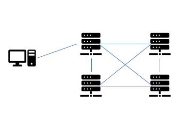

# WeIdentity 性能测试报告

## 1. 测试结论

### 1.1 WeIdentity v1.6.0测试结论

测试结论：各接口性能均符合预期

测试数据：如下表

| 接口                        | 交易数      | 平均响应    | 最小响应 | 最大响应  | TPS      |
| ------------------------- | -------- | ------- | ---- | ----- | -------- |
| CreateWeId                | 59534    | 2031    | 184  | 7774  | 199      |
| GetWeIdDocument           | 685187   | 175     | 3    | 1286  | 2285     |
| SetPublicKey              | 85931    | 1412    | 41   | 4842  | 286      |
| IsAuthorityIssuer         | 1707173  | 70.16   | 1    | 1048  | 5708     |
| IsSpecificTypeIssuer      | 900017   | 133.3   | 3    | 1763  | 3063.23  |
| QueryAuthorityIssuerInfo  | 982550   | 122.12  | 2    | 1912  | 3314.7   |
| QueryCpt                  | 25757519 | 数据暂无       | 0    | 40    | 86071.28 |
| CreateCredential          | 101318   | 103.36  | 1    | 10184 | 3343.97  |
| CreateSelectiveCredential | 4765140  |  数据暂无       | 0    | 263   | 15946.42 |
| CreatePresentation        | 716447   | 85.89   | 3    | 1447  | 2831.7   |
| Verify                    | 493131   | 242.88  | 9    | 1416  | 1662.27  |
| VerifyByPresention        | 302936   | 396.49  | 10   | 2566  | 1015.41  |
| CreateEvidence            | 65881    | 1827.24 | 117  | 5047  | 221.84   |
| GetEvidence               | 648350   | 185.2   | 4    | 1446  | 655.66   |
| VerifySigner              | 669416   | 179.53  | 4    | 1286  | 2235.85  |
| AddLogByHash              | 81579    | 1491.49 | 83   | 4739  | 273.73   |
| BarCodeTransportation     | 63019    | 1921    | 32   | 13759 | 210.95   |

说明：本次压测采用的是8核16G机器进行压测，四节点组网，压力主要在交易节点；

通过观察发现并发数增加时，TPS和RT对应增加，综合考虑TPS和RT，所有接口均采用并发数500进行数据采集。

### 1.2 WeIdentity v1.6.1测试结论

测试结论：性能均符合预期

测试数据：如下表

| 接口                  | 交易数     | 平均响应    | 最小响应 | 最大响应  | TPS   |
| ------------------- | ------- | ------- | ---- | ----- | ----- |
| BatchCreateEvidence | 1908563 | 4523.27 | 308  | 11877 | 22.09 |

说明：针对该接口进行长时间压力测试，当并发数设置成100，credentialPojo列表设置成100时，TPS和平均响应时间表现最佳，最后计算出每秒上链的TPS总数=22.9*100。

### 1.3 测试内容

对WeIdentity SDK 进行压测，采用的是梯度增压的方式进行压力测试， 观察 sdk主要接口的TPS和RT，找出符合系统预期的最佳TPS和RT。

### 1.4 测试总结

本次测试共采集3组TPS性能数据，从测试结果分析：

1. 在并发数增加时，TPS和RT响应会增加，综合考虑，采用500并发的数据进行数据采集；
2. 测试机和区块连交易节点在同一个局域网内，网络响应时间0.2ms，网络不影响整个响应时间；
3. 通过nmon观察服务器的CPU、内存、I/O读写速度，均不存在瓶颈；
4. 压测时间持续5分钟，系统TPS进入稳定状态，同时TPS不会随区块链块高变化。

## 2.测试环境

### 2.1 测试组网

组网描述：

4个区块链节点分别部署在4台服务器上，机器配置为8核16G，按两个机构各两个节点的场景模拟。Jmeter压测机（需要安装jmeter环境，配置最好也是8核16G）会把交易通过sdk往一个区块链节点进行发送。

### 2.2 软硬件环境

实验室内网云机器，服务器操作系统CentOS Linux release7.5.1804。

### 2.3  压测客户端

Jmeter 5.1.1 压测程序，安装在linux环境上，采用单客户端模式进行压测

### 2.4 软件版本

| **子系统**        | **版本号**         | **说明**  |
| -------------- | --------------- | ------- |
| FISCO-BCOS     | FISCO BCOS V2.2 | 底层节点版本  |
| web3sdk        | release-2.1.3   | 配套sdk版本 |
| WeIdentity SDK | 最新发布版本          | 待测程序    |

