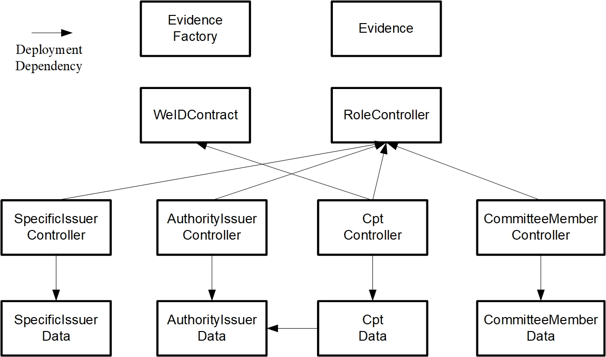

.. role:: raw-html-m2r(raw)
   :format: html

.. _weidentity-contract-design:

WeIdentity 智能合约设计与实现
===============================

WeIdentity智能合约概述
----------------------------

WeIdentity使用基于Solidity的智能合约进行开发。Solidity的智能合约语义上是图灵完备的，该语言支持各种基础类型（Booleans，Integers，Address，Bytes，Enum等)、复杂类型（Struct，Mapping，Array等）、复杂的表达式、控制结构和远程调用，以及接口、继承等面向对象的高级语言特性。Solidity是以太坊和FISCO-BCOS所支持的智能合约语言。

智能合约功能强大，因而真实世界中的复杂商业逻辑和应用可以在区块链上轻松实现。然而，智能合约一旦部署，它会在所有区块链节点上独立重复运行，因此原则上认为，只有各业务方需要进行共识的、逻辑可复用的业务才有必要通过智能合约在链上实现。此外，智能合约发布之后，若出现问题需要修复或者业务逻辑变更，是无法通过简单地在原有合约基础上修改再重新发布来解决的。因此，在设计之初还需要结合业务场景思考合适的合约更新机制。总体上，WeIdentity合约的设计原则是：功能完备、逻辑清晰、模块解耦、结构清晰、安全完备、支持升级。

当前，WeIdentity合约层面的工作目标主要包括两部分：

- **WeIdentity DID智能合约**，负责链上ID体系建立，具体包括生成DID（Distributed IDentity）、生成DID Document、DID在链上的读取与更新。
- **WeIdentity Authority智能合约**，负责进行联盟链权限管理，具体包括链上DID角色的定义、操作与权限的定义与控制。

下文将会基于业务目标对这两部分展开描述。

WeIdentity DID智能合约
----------------------------

概述
^^^^^^^^

从业务视角来看，DID智能合约只需要做一件事，就是如何定义DID Document的存储结构和读写方式。DID Document的结构并不复杂（见规范文档）；但在实际的业务中，存在一些挑战：

- 伴随着接入用户（人与物）的快速增长，DID的总量将会增长迅速，规模庞大。因此，设计一个大而全的映射表是不现实的，这会带来巨大的寻址开销，即使采用传统分库、分表、跨链的思路也难以应付。
- DID存在更新的需求。因此，每次都存储完整的Document域在更新情况下会产生大量的历史数据。

因此，WeIdentity使用Linked Event：基于事件链的存储方法来解决以上问题。

存储结构
^^^^^^^^

Linked Event的核心实现思路是借助Solidity的事件（Event）机制，采用类似链表的思路对DID Document的更新进行存储和读取。在Solidity里，每个区块都有对应的Event存储区，用于对区块相关的事件进行存储，并最终存入Event log。因此，存储层面上，在不同时间点DID的更新可以存入更新时当前块的Event里，同时将当前块高作为索引记录每次更新事件。读取层面上，如果要读取完整DID Document，只需按索引反向遍历对应的块的Event里即可。基于这一思路，进行以下设计：

- 设计一个映射记录，使用DID的地址作为索引，用来存储每个DID最近的一次更新事件所对应的块高；
- 设计一个更新事件，用来记录每次DID更新的相关属性及前一个块高；
- 设计一个查询函数，用来读取映射记录找到某个DID的最近的块高，以便反向解析具体的更新事件。

以上数据和逻辑会被合并到一个整体合约里。具体流程为：

- 每当触发一次DID Document的属性更新，就记入一次更新事件，同时记录更新事件所对应的当前块高，存入整体合约的记录映射部分；
- 记录映射部分存入整体合约的存储区，更新事件最终会存入区块链的Event；
- 当读取DID Document时，只需通过记录映射读取块高，反向遍历对应的块的Event，解析并找到Document更新相关的事件内容，然后合并即可。

这一流程图可见于：

.. image:: ./images/linked-events.png
   :alt: linked-events.png

性能评估
^^^^^^^^

使用Linked Event进行存储的优势有以下几点：

- 非常适合更新的场景。由于Solidity Event的特性，本方案的写性能和存储开销会远远优于完整存储DID Document内容进入合约的解决方案。
- 更方便的记录历史版本。通过记录每个事件的块高，可以快速的定位到每个事件，在溯源场景下有着广泛的应用；同时，又不需对那些未更新的属性项进行存储。
- 读性能对更新事件是O(N)的时间增长。因此，在Document更新不频繁的场景下，读性能非常好。由于WeIdentity的DID本身更多地用来存储公钥等信息，更新频率大部分情况下并不高，因此非常适合WeIdentity的使用场景。

WeIdentity Authority智能合约
----------------------------

概述
^^^^^^^^

Authority智能合约的主要任务是联盟链的权限管理。在WeIdentity的业务场景中，存在以下挑战：

- 不同的DID实体拥有不同的权限。

例如，存在Authority Issuer这一角色用来描述现实世界中的「权威凭证发行者」，它们能够发行低段位授权CPT，权限高于一般的DID；更进一步地，在Authority Issuer之上存在着委员会（Committee），它们的权限更高，包括了对Authority Issuer的治理等内容。因此，WeIdentity需要设计合理的「角色—操作」二元权限控制。

- 权限管理的业务逻辑会随着业务迭代而不断更新。

在真实业务场景中，随着业务变化，权限管理逻辑也可能随之改变；同时，不同的业务方可能会有定制化权限管理的需求。因此，WeIdentity需要进行合理的分层设计，将数据和行为逻辑分离，在升级的情况下就只需对行为逻辑部分进行升级，数据存储保持不变，尽可能地降低更新成本。

当前，业内已经有了一些对权限进行操作和维护的开源解决方案，如ds-auth和OpenZepplin的Role智能合约；但它们的权限管理逻辑可扩展性较差且不支持合约分层更新。下文将介绍WeIdentity的Authority智能合约实现。

架构
^^^^^^^^

角色与权限
~~~~~~~~~~~~~~

当前的WeIdentity角色设计了四种角色：

- 一般DID。一般的实体（人或物），由WeIdentity的分布式多中心的ID注册机制生成，没有特定权限。
- Authority Issuer。授权机构，具有发行低段位授权CPT的权限。
- Committee Member。机构委员会成员。具有管理Authority Issuer成员资格的权限。
- Administrator。系统管理员。具有管理Committee Member及Authority Issuer成员资格的权限，未来还包括修改合约地址的权限。

每个角色具体的权限表如下：

.. raw:: html

    <embed>
      <table border='1' style="border-collapse:collapse" class='tables'>
         <tr>
            <th>操作</th>
            <th>一般DID</th>
            <th>Authority Issuer</th>
            <th>Committee Member</th>
            <th>Administrator</th>
         </tr>
         <tr>
            <td>增删改Administrator</td>
            <td>N</td>
            <td>N</td>
            <td>N</td>
            <td>Y</td>
         </tr>
         <tr>
            <td>增删改Committee Member</td>
            <td>N</td>
            <td>N</td>
            <td>N</td>
            <td>Y</td>
         </tr>
         <tr>
            <td>增删改Authority Issuer</td>
            <td>N</td>
            <td>N</td>
            <td>Y</td>
            <td>Y</td>
         </tr>
         <tr>
            <td>发行授权CPT</td>
            <td>N</td>
            <td>Y</td>
            <td>Y</td>
            <td>Y</td>
         </tr>
      </table>
       
    </embed>

合约分层
~~~~~~~~~~~~~~

WeIdentity采用分层设计模式，即将合约分为逻辑合约、数据合约、及权限合约。

- 逻辑合约：它专注于数据的逻辑处理和对外提供接口，通过访问数据合约获得数据，对数据做逻辑处理，写回数据合约。一般情况下，控制器合约不需要存储任何数据，它完全依赖外部的输入来决定对数据合约的访问。
- 数据合约：它专注于数据结构的定义、数据内容的存储和数据读写的直接接口。
- 权限合约：它专注于判断访问者的角色，并基于判断结果确定不同操作的权限。

上述架构图如下：

.. image:: ./images/authority-contract-arch.png
   :alt: authority-contract-arch.png

权限与安全管理
~~~~~~~~~~~~~~

当前的WeIdentity权限管理的挑战是：

- 合约在链上部署之后，攻击者可能会绕过SDK直接以DApp的形式访问合约。因此合约层面必须要有自完善的权限处理逻辑，不能依赖SDK。
- 数据合约是公开的，因此数据合约的操作也需要进行权限管理。

WeIdentity的权限管理依赖于一个独立的RoleManager权限管理器合约，它承担了合约所有的权限检查逻辑。WeIdentity的权限粒度是基于角色和操作的二元组，这也是当前大多数智能合约权限控制的通用做法。它的设计要点包括：

- 将角色和操作权限分别存储。
- 设计一个权限检查函数checkPermission()供外部调用，输入参数为「地址，操作」的二元组。
- 对角色和权限分别设计增删改函数供外部调用。
- 所有WeIdentity的数据合约里需要进行权限检查的操作，都通过外部合约函数调用的方式，调用checkPermission()。
- 所有WeIdentity依赖权限管理器的合约，需要有更新权限管理器地址的能力。

WeIdentity的权限管理有以下特性：

- 优秀的可扩展性。WeIdentity的权限控制合约使用外部调用而非继承（如ds-auth和OpenZepplin的Role智能合约实现角色管理方式）方式实现。在权限控制合约升级的场景中，外部调用方案只需简单地将权限管理器合约地址更新即可，极大地提升了灵活度。
- 使用tx.origin而非msg.sender进行调用源追踪。这是因为用户的权限和自己的DID地址唯一绑定。因此所有权限的验证必须要以最原始用户地址作为判断标准，不能单纯地依赖msg.sender。此外，WeIdentity的权限控制合约需要支持更大的可扩展性，以支持更多公众联盟链的参与成员自行实现不同的Controller。因此，需要通过tx.origin追踪到调用者的WeIdentity DID，并根据DID确定权限。

Specific Issuer（Issuer链上类型声明）
^^^^^^^^^^^^^^^^^^^^^^^^^^^^^^^^^^^^^

WeIdentity支持为每位Authority Issuer在链上声明所属类型，即Specific Issuer。您可以指定某位Authority Issuer的具体类型属性，如学校、政府机构、医院等。当前，此属性与其对应的权限没有直接关系，仅作记录之目的。

WeIdentity Evidence智能合约
----------------------------

WeIdentity不仅提供了基于DID的公钥存储 + 数字签名用来防止凭证被篡改，同时也提供了Evidence存证功能，基于区块链不可篡改的特性，为创建出的凭证增信。简单来说，任何使用者，都可以将凭证的内容摘要上传到链上，以便在未来使用时可以根据链上内容比对，以防篡改。内容摘要使用Hash算法，抗逆向反推。

从WeIdentity SDK 1.5.2+版本开始，Evidence智能合约开始使用类似WeID智能合约的Linked-Event形式进行hash内容的存储。它支持多个不同的签名方对存证打上自己的签名进行背书；同时也支持签名方为存证填入额外记录（log）。不同的log会按照写入区块链的顺序垒叠起来，形成不可篡改的记录集。

存证合约有以下特性：

- 签名的Hash值在创建时就已确定且不可更改。
- 不同的签名方可以通过调用createEvidence接口为同一个存证增加来自于不同签名方的签名。
- 签名方可以调用增加记录接口（addLog）为存证添加额外信息。
- 添加的额外信息（log记录）只能追加，不能修改或删除。
- 不同的签名方的签名信息和额外信息存储互不干扰。
- 如果一不小心写错了存证信息，就创建一个新存证吧！

WeIdentity CPT智能合约
------------------------

WeIdentity的CPT（Claim Protocol Type）合约，用于在链上存储凭证的Claim模板。CPT合约使用标准的数据-逻辑分离架构。一个数据CPT合约里，最重要的是其jsonSchema部分，它存储了以jsonSchema格式记载的Claim格式内容。区分不同CPT是通过其ID来进行的。

根据CPT使用目的、内容的不同，ID可以被划分成以下三个范围：1~1000（系统CPT），1000~2000000（授权CPT），2000000以上（普通CPT）。

系统CPT表
^^^^^^^^^^^

系统CPT的ID落在1~1000里，它们是在WeIdentity智能合约部署之初就创建好的内置CPT，用来完成所有WeIdentity实例的统一功能，它们在部署WeIdentity智能合约时，在初始化过程中部署在链上。系统CPT不支持任何角色创建。

当前，系统CPT表包括以下内容：

.. raw:: html

    <embed>
      <table border='1' style="border-collapse:collapse" class='tables'>
         <tr>
            <th>ID</th>
            <th>标题</th>
            <th>内容</th>
         </tr>
         <tr>
            <td>101</td>
            <td>授权凭证</td>
            <td>某个WeID授权另一个WeID使用数据</td>
         </tr>
         <tr>
            <td>102</td>
            <td>挑战凭证</td>
            <td>某个WeID对另一个WeID身份证明的挑战</td>
         </tr>
         <tr>
            <td>103</td>
            <td>身份验证凭证</td>
            <td>某个WeID针对CPT102的挑战的回复</td>
         </tr>
         <tr>
            <td>104</td>
            <td>Claim Policy</td>
            <td>某个选择性披露的Claim Policy定义</td>
         </tr>
         <tr>
            <td>105</td>
            <td>API Endpoint</td>
            <td>Endpoint端点服务的端点定义</td>
         </tr>
         <tr>
            <td>106</td>
            <td>嵌套凭证</td>
            <td>嵌套的Credential，用来进行多签</td>
         </tr>
         <tr>
            <td>107</td>
            <td>嵌套凭证</td>
            <td>嵌套的CredentialPojo，用来进行多签</td>
         </tr>
         <tr>
            <td>108</td>
            <td>整合可信时间戳</td>
            <td>为某个嵌套凭证生成的可信时间戳，包含凭证原文</td>
         </tr>
         <tr>
            <td>109</td>
            <td>可分离可信时间戳</td>
            <td>为某个嵌套凭证生成的可信时间戳，不包含凭证原文</td>
         </tr>
      </table>
       
    </embed>

关于每个系统CPT的详细字段要求，可以查阅代码中的
\ `对应文件 <https://github.com/WeBankBlockchain/WeIdentity/tree/master/src/main/java/com/webank/weid/protocol/cpt>`_\ 
，此处不再详细展开。

授权CPT
^^^^^^^^

授权CPT的ID落在1000~2000000里，如Authority合约中所述，授权CPT仅支持由Authority Issuer创建，一般是和具体的联盟链业务相关。

一般CPT
^^^^^^^^

一般CPT的ID从2000000开始自增。任何WeID均可以创建此类CPT。

WeIdentity智能合约依赖关系
----------------------------

