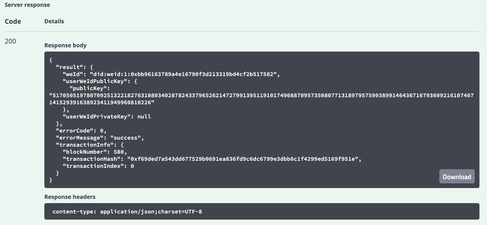
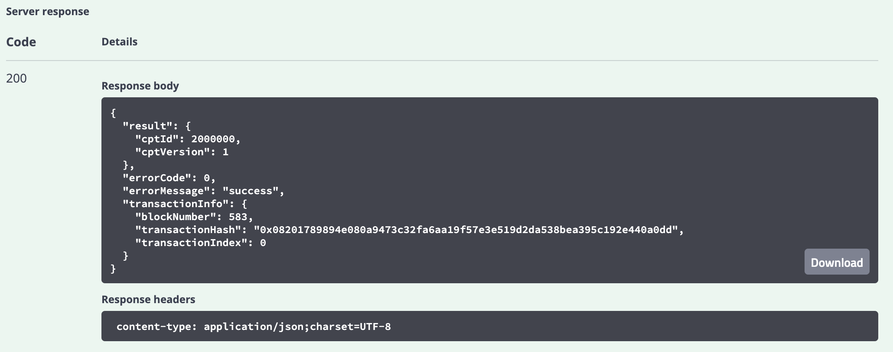
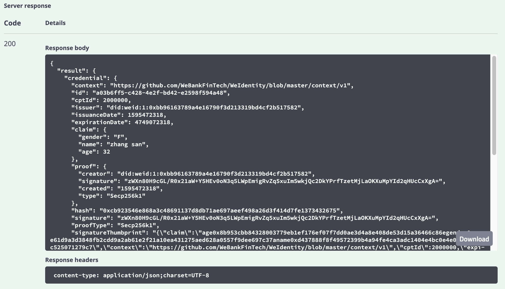
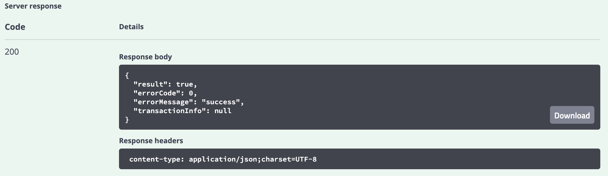

体验使用WeIdentity Sample
------------------------------

前提条件
~~~~~~~~

运行 WeIdentity-Sample 需要提前使用 WeIdentity 部署工具完成部署，请参考\ `WeIdentity JAVA
SDK安装部署 <./one-stop-experience.html>`__\ 完成部署，并参照\ `Java应用集成章节 <./weidentity-build-with-deploy.html#weid-java-sdk>`__\ 完成
weid-sample 的配置。

1. 配置与部署
~~~~~~~~~~~~~~~~

1.1 下载 WeIdentity-Sample 源码：
''''''''''''''''''''''''''''''''''''

.. code:: shell

    git clone https://github.com/WeBankFinTech/WeIdentity-Sample

.. note::
     如果您的服务器在中国内地，下载速度可能会比较慢，可以直接使用在国内的源：:code:`git clone https://gitee.com/WeBank/WeIdentity-Sample`

1.2 配置基本信息
''''''''''''''''''''''''''''''''''''''
若您在体验WeIdentity Sample之前已经完成WeIdentity Build Tool的部署和配置，weid-sample会自动从Build Tool中加载基本配置信息，无需您再次进行配置。

若您想单独体验WeIdentity Sample, 您可以参考\ `部署weid-java-sdk与配置基本信息 <./weidentity-sample-deploy.html>`__\进行配置。

- 编译 WeIdentity-Sample

如果您是第一次运行 WeIdentity-Sample，您需要先进行编译：

.. code:: shell

chmod +x build.sh
./build.sh

2. Swagger服务方式体验接口
~~~~~~~~~~~~~~~~~~~~~~~~~~~~~~~~~~~

使用 spring-boot 方式，weid-sample 程序将作为一个后台进程运行，您可以使用swagger可视化地体验交互流程。

2.1 启用服务
''''''''''''''''''''''''

.. code:: shell

    chmod +x build.sh start.sh stop.sh
    ./start.sh

若启动成功，则会打印以下信息：

::

    [main] INFO  AnnotationMBeanExporter() - Registering beans for JMX exposure on startup
    [main] INFO  Http11NioProtocol() - Initializing ProtocolHandler ["https-jsse-nio-6101"]
    [main] INFO  Http11NioProtocol() - Starting ProtocolHandler ["https-jsse-nio-6100"]
    [main] INFO  NioSelectorPool() - Using a shared selector for servlet write/read
    [main] INFO  Http11NioProtocol() - Initializing ProtocolHandler ["http-nio-6101"]
    [main] INFO  NioSelectorPool() - Using a shared selector for servlet write/read
    [main] INFO  Http11NioProtocol() - Starting ProtocolHandler ["http-nio-6101"]
    [main] INFO  TomcatEmbeddedServletContainer() - Tomcat started on port(s): 6100 (https) 6101 (http)
    [main] INFO  SampleApp() - Started SampleApp in 3.588 seconds (JVM running for 4.294)

2.2 流程演示
''''''''''''''''''''''''

以下将为您演示
假设您的服务部署在本地，地址是 ``127.0.0.1``，服务端口是 ``6101``。您可以在 ``resources/`` 里修改端口信息。
您可以使用浏览器打开http://127.0.0.1:6101/swagger-ui.html，通过可视化的方式体验WeIdentity的核心功能。

- 创建 WeID

单击``/step1/issuer/createWeId``，创建WeID，并返回结果。

若调用成功，则会显示以下信息：

表明创建的 WeID 是 did:weid:1:0xbb96163789a4e16790f3d213319bd4cf2b517582。

- 注册 Cpt

单击``/step2/registCpt``，参数里的 publisher 传入step1刚刚注册的WeID

运行成功，则会打印以下信息：

表明注册 CPT 成功，CPT ID 为 2000000。

- 创建 Credential

单击``/step3/createCredential``，修改参数``claimData``为具体值，参数issuer为step1的WeID，参数cptId为step2返回的Cpt ID

运行成功，则会打印以下信息：

表明创建 Credential 成功，Credential 的具体信息为图中的 credential 字段对应的内容。

- 验证 Credential

单击``/step1/verifyCredential``，修改参数为上步所得到的``credential``。

若运行成功，则会打印以下信息：

表明 Credential 验证成功。

至此，您已经体验了 weid-sample 实现的各个角色的运行流程，实现的入口类在weid-sample工程的 ``com.webank.weid.demo.server.SampleApp``，您可以参考进行您的 Java 应用开发。

3. 命令行方式使用
~~~~~~~~~~~~~~~~~~~~~~~~~~~~~~~

命令行方式比较完整的模拟了各个 \ `WeIdentity 角色 <./weidentity-spec.html#id9>`__\ 的工作流程，可以帮您快速体验 WeIdentity 也业务流程和运行机制。
各个角色的基本流程如下：

- Issuer

 | 创建 WeID
 | 注册成为 Authority Issuer
 | 注册 CPT
 | 创建 Credential

- User Agent

 | 创建 WeID
 | 创建 Presentation
 | 打包 Presentation 成 QRcode 或者 Json 串，发送给 Verifier

- Verifier

 | 获取 User Agent 的 Presentation
 | 验证 Presentation

3.1 基本流程的演示
''''''''''''''''''''''''

- Issuer 操作流程演示

.. code:: shell

    chmod +x command.sh
    ./command.sh issuer

若运行成功，则会打印包括创建 WeID、注册成为 Authority Issuer、注册 CPT 和创建 Credential 等运行流程。

以下为截取的部分流程日志：
::

    --------- start issuer ----------
    issuer() init...

    begin to createWeId...

    createWeId result:

    result:(com.webank.weid.protocol.response.CreateWeIdDataResult)
    weId: did:weid:1:0x7a276b294ecf0eb7b917765f308f024af2c99a38
    userWeIdPublicKey:(com.webank.weid.protocol.base.WeIdPublicKey)
        publicKey: 1443108387689714733821851716463554592846955595194902087319775398382966796515741745
        951182105547115313067791999154982272567881519406873966935891855085705784
    userWeIdPrivateKey:(com.webank.weid.protocol.base.WeIdPrivateKey)
        privateKey: 46686865859949148045125507514815998920467147178097685958028816903332430030079
    errorCode: 0
    errorMessage: success
    transactionInfo:(com.webank.weid.protocol.response.TransactionInfo)
    blockNumber: 2098
    transactionHash: 0x20fc5c2730e4636248b121d31ffdbf7fa12e95185068fc1dea060d1afa9d554e
    transactionIndex: 0

    begin to setPublicKey...

    setPublicKey result:

    result: true
    errorCode: 0
    errorMessage: success
    transactionInfo:(com.webank.weid.protocol.response.TransactionInfo)
    blockNumber: 2099
    transactionHash: 0x498d2bfd2d8ffa297af699c788e80de1bd51c255a7365307624637ae5a42f3a1
    transactionIndex: 0

- User Agent 操作流程演示

.. code:: shell

    ./command.sh user_agent

运行成功，则会打印包括创建 WeID、创建 Presentation 以及打包 Presentation 成 QRcode 或者 Json 串的流程。
以下为截取的部分日志：

::

    --------- start User Agent ----------
    userAgent() init...

    begin to create weId for useragent...

    createWeId result:

    result:(com.webank.weid.protocol.response.CreateWeIdDataResult)
    weId: did:weid:1:0x38198689923961e8ecd6d57d88d027b1a6d1daf2
    userWeIdPublicKey:(com.webank.weid.protocol.base.WeIdPublicKey)
        publicKey: 12409513077193959265896252693672990701614851618753940603742819290794422690048786166
        777486244492302423653282585338774488347536362368216536452956852123869456
    userWeIdPrivateKey:(com.webank.weid.protocol.base.WeIdPrivateKey)
        privateKey: 11700070604387246310492373601720779844791990854359896181912833510050901695117
    errorCode: 0
    errorMessage: success
    transactionInfo:(com.webank.weid.protocol.response.TransactionInfo)
    blockNumber: 2107
    transactionHash: 0x2474141b82c367d8d5770a7f4d124aeaf985e7fa3e3e2f7f98eeed3d38d862f5
    transactionIndex: 0

- Verifier 操作流程演示

.. code:: shell

    ./command.sh verifier

运行成功，则会打印 Verifier 反序列化 Presentation 以及验证 Presentation 的过程。
以下为截取的部分日志，详细流程可以参考代码实现：

::

    --------- start verifier ----------
    verifier() init...

    ------------------------------

    begin create weid for verifier...

    createWeId result:

    result:(com.webank.weid.protocol.response.CreateWeIdDataResult)
        weId: did:weid:1:0xc43f2c19d118069334465203caec2f172b309c58
        userWeIdPublicKey:(com.webank.weid.protocol.base.WeIdPublicKey)
            publicKey: 1802001392887294114478621319460626832326728735808626637646481738691052543569123247811055025421632020659858167535619017862031831947976217438376528638044178
        userWeIdPrivateKey:(com.webank.weid.protocol.base.WeIdPrivateKey)
            privateKey: 18729487184487047589926382583327624427891635082897243001876050275017499781990
    errorCode: 0
    errorMessage: success
    transactionInfo:(com.webank.weid.protocol.response.TransactionInfo)
        blockNumber: 63
        transactionHash: 0xe76321d5778ed627f2dd051eb327e7dc5190180013691ef73b21b5c264fffad8
        transactionIndex: 0

    ------------------------------

    begin get the presentation json...

至此，您已经体验了 WeIdentity-Sample 实现的各个角色的运行流程，实现的入口类在 WeIdentity-Sample 工程的 ``com.webank.weid.demo.command.DemoCommand``，您可以参考进行您的 Java 应用开发。

.. toctree::
   :hidden:
   :maxdepth: 1

   weidentity-sample-deploy.rst
